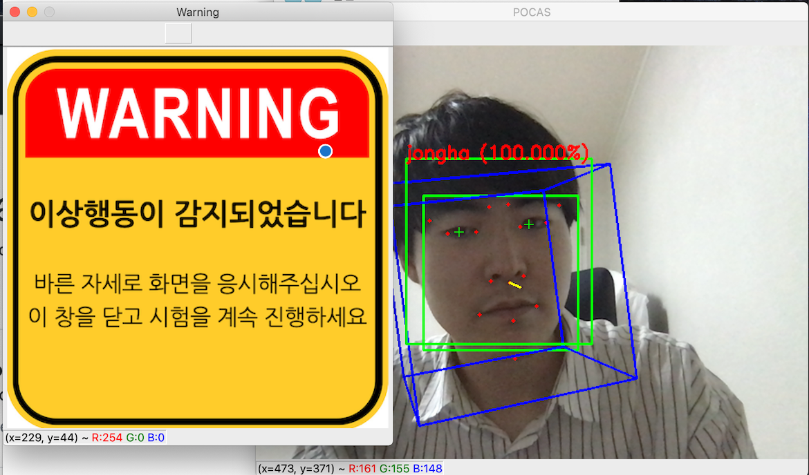

# POCAS
-----
### POstech Cheating detection Ai System
* 시선 및 모션 인식, 그리고 안면 인증을 통한 온라인 시험 부정 행위 방지 시스템

### OVERVIEW
#### Example Screenshot
  

#### demonstration video

* 이미지 클릭시, youtube에서 데모 영상을 시청할 수 있습니다.

### Project 개요
* 코로나 사태로 인하여 대부분의 오프라인 시험이 온라인으로 대체되고 있음 (2020.06 기준)
* 온라인 시험으로 인해 수 많은 부정행위가 발생하며, 부작용으로 떠오르고 있음
* 실제로 인하대학교 의과대학에서 온라인 시험 부정행위가 적발되어 큰 이슈로 떠오름
* 위와 같은 부작용을 해결하고자, 눈동자 및 머리의 동작 인식을 통해 부정행위를 방지하고자 함. 

### Referenced Code
* https://github.com/antoinelame/GazeTracking
* https://github.com/alisyedraza99/Real-Time_Face-Recognition-System
* https://github.com/qhan1028/Headpose-Detection

### Requirements
* Python 3.7
  * dlib
  * opencv-python
  * numpy
  * pygame
  * keras
  * pil
  * mtcnn

* Please check `Dockerfile` for more information.

### Best Setup  And Execute
* https://github.com/JoyLeeA/POSCO_AIProject_OnlineTestCheatingDetectionAiSystem.git
* `./setup.sh`

### Second Best Setup And Execute
* https://github.com/JoyLeeA/POSCO_AIProject_OnlineTestCheatingDetectionAiSystem.git
* pip install -r requirements.txt

### Usage
#### 사전 준비
1. 데이터 셋 준비
    응시자의 사진 데이터를 모아서 dataset 폴더에 넣습니다.
    (샘플의 0.7 만큼을 train, 0.3만큼을 val에 넣습니다.
    train은 train에 사용되며, val은 학습한 데이터를 테스트 하는데 사용됩니다.)
2. friends_dataperp.py를 실행해서, 학습 데이터 셋으로 npz파일을 만듭니다. (FriendsDataSet.npz)
3. facenet.py를 실행하여 embedding이 수행된 새로운 npz파일을 만듭니다.(FreindsFaceEmbeddingData.npz)
4. SVMclassifier.py를 실행하여 얼굴을 분류합니다. (test 용도)
#### 실행
 * python pocas.py (Main)
 #### 작동원리
 * 관리자는 시험 시간을 설정 할 수 있음 (Minute 단위)
 * 사용자의 사진 데이터를 training하여 신원 확인을 함
 * 신원 확인 후에도 지속적으로 안면을 감지하여 다른 사람이 대신 시험을 보는 것을 방지
 * 동공의 움직임을 인식하여, 다른 사물을 통해 부정행위를 하는 것을 방지함
 * 동공이 카메라 밖을 응시하면, yellocard가 2씩 증가하며, 그렇지 않은 경우 1씩 감소함.
 * 얼굴의 움직임을 감지하여, 다른 사물을 통해 부정행위를 하는 것을 방지함
 * 정면을 기준으로 15도 이상 움직일 경우,  yellocard가 2씩 증가하며, 그렇지 않은 경우 1씩 감소함.
 * yellocard 수치가 50만큼 쌓이면, redcard수치가 1씩 증가함. (yellocard는 0으로 초기화)
 * redcard가 1씩 증가할 때마다, Warning Sound 호출
 * redcard가 2개만큼 쌓이면, Warning Image 출력
 * redcard >= input time / 3 의 조건이 만족하면 부정행위자로 판별
 
 #### 주의사항
* 본 System은 tensorflow, cv2등 무거운 라이브러리 위주로 가동됨
* 따라서, CPU가 아닌 GPU 환경에서 사용할 것을 권장함
 
### Explain Folder
* documents: 프로젝트를 진행하며 생성된 문서 산출물
* dataset:  신원 확인을 목적으로 사용자의 얼굴을 학습하기 위한 데이터 셋
* models: 얼굴 인식을 위한 facenet trained set
* docker: nvidia GPU 사용 가상 환경 구축
* Warning: 경고 표시를 위한 시청각 파일
* faceidentify: facenet을 활용한 신원 확인 코드 (.py) 
* gaze_tracking: 동공 인식과 시선 감지를 위한 코드 (.py)
* detectheadposition: 얼굴의 움직임을 감지하기 위한 코드(.py)
 
